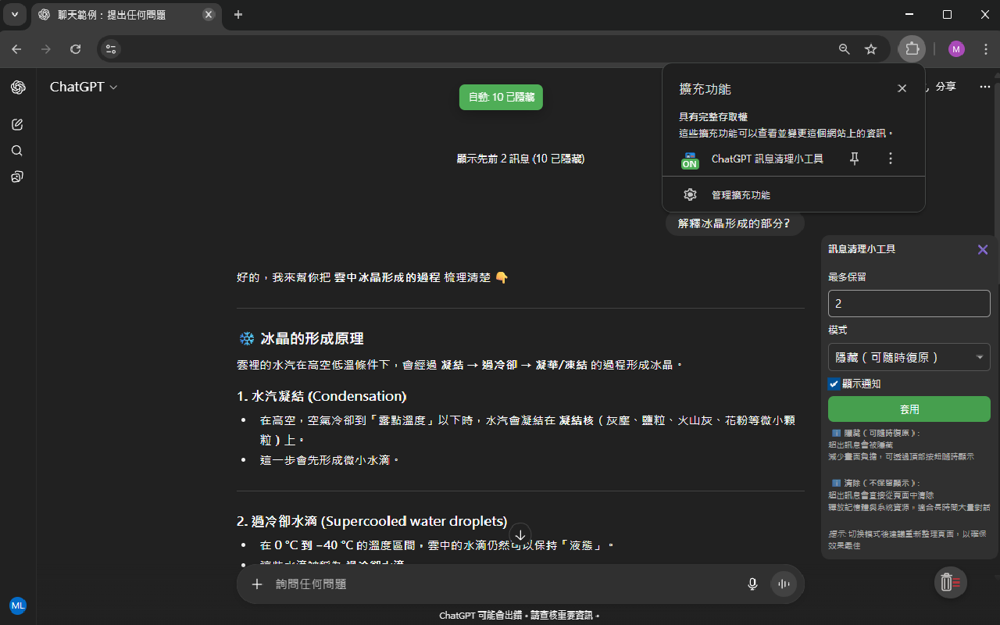

# ChatGPT Message Cleaner

**🌐 Languages:** [English](./README.md) | [繁體中文](./docs/README_zh-TW.md)

<!-- markdownlint-disable MD033 -->

<p align="center">
  
</p>
<!-- markdownlint-enable MD033 -->

Lightweight ChatGPT conversation cleaner: Keep recent messages, hide or delete older content to reduce page load.


---

## Download

* **Chrome Web Store**: [Install here](https://chromewebstore.google.com/detail/dklkegnbfbgdafdbipiplcbijklpkklp)
* **Microsoft Edge Add-ons**: [Install here](https://microsoftedge.microsoft.com/addons/detail/ifmghkemkdghcflndnpldoookcfhinaj)

## Features

* **Cleaning Modes:**
  * **Hide**: Remove older messages from view but keep in DOM, restorable anytime
  * **Delete**: Completely remove from DOM (`Element.remove()`), especially helpful for extremely long conversations
* **Load Protection**: Detects high task density and average processing time, automatically pauses when busy
* **Idle Processing**: Uses idle time for processing with dynamic batch size adjustment
* **Auto Speed Control**: Adaptive delays based on average processing time
* **Show Previous**: Quickly restore older content when needed
* **Multi-language**: en / zh-TW / zh-CN

## Screenshot

<!-- markdownlint-disable MD033 -->
<p align="center">
  
</p>
<!-- markdownlint-enable MD033 -->

---

## Scope & Design Considerations

This tool focuses on "frontend view layer throttling and organization" by reducing visible elements and DOM pressure to improve perceived smoothness, while respecting the site's own mechanisms. The following scenarios are not directly covered, and improvement may vary depending on site design:

* Model/network inherent latency
* Global state, virtual lists, tracking scripts, and other non-DOM costs within the site
* Server-side conversation length, sync/cache, or non-DOM memory usage

**Design Highlights:**

* **Hide**: Nodes remain in DOM but visual and interaction are removed (`aria-hidden`, `inert`), can be quickly restored
* **Delete**: Nodes are removed from DOM (`Element.remove()`), can free DOM memory; actual effect still depends on overall site behavior
* **Load Protection**: Detects busy periods and pauses, resumes and retries after recovery

In short: This tool is a "frontend view layer organizer" that tries not to conflict with complex internal site mechanisms and doesn't touch your account/cloud data. If the conversation itself is extremely large or the site is under heavy load, you may still experience lag.

---

## Installation (Manual Loading)

1. Get the code and install dependencies (Recommended: Yarn v4 via Corepack; npm/pnpm also supported)

    ```bash
    git clone https://github.com/MeowXiaoXiang/ChatGPT-Cleaner.git
    cd ChatGPT-Cleaner

    # Recommended: Use Corepack to enable Yarn v4 (not mandatory)
    corepack enable
    corepack prepare yarn@stable --activate
    yarn install

    # Or use npm / pnpm / Yarn v1
    # npm install
    # pnpm install
    ```

2. Build (outputs to dist/)

    ```bash
    yarn build
    # or npm run build / pnpm run build
    ```

3. Load in Chrome (Extensions → Developer mode → Load unpacked)

    * Open chrome://extensions
    * Enable "Developer mode"
    * Click "Load unpacked", select the `dist/` folder

> For development, use `yarn dev` to enter watch mode (automatically rebuilds and copies static resources to dist).

---

## Usage

* **Toolbar Button**: Click to toggle enable/disable (badge shows ON/OFF)
* **Floating Ball (bottom right)**: Click to open panel settings for Keep up to / Mode (Hide or Delete) / Notifications
* **Hide Mode**: "Show previous" button appears at the top of conversations to restore older messages

---

## Project Structure

```text
│  .gitignore              # Git ignore rules
│  esbuild.config.mjs      # Esbuild bundling configuration
│  LICENSE                 # License (MIT)
│  package.json            # Package and script definitions
│  README.md               # Project documentation
│  tsconfig.json           # TypeScript compilation settings
│
├─scripts                  # Helper scripts
│      postinstall.js      # Post-install auto-execution (SDK registration)
│      zip.js              # Package dist/ into zip
│
├─src
│  │  manifest.json        # Chrome extension configuration (Manifest v3)
│  │
│  ├─background            # Background service
│  │      background.ts
│  │
│  ├─content               # Frontend injection scripts
│  │      debug.ts         # Debug panel with real-time metrics & charts
│  │      dom-utils.ts     # DOM utilities (selectors, styling, marking)
│  │      idle-utils.ts    # Idle callback wrapper for smooth processing
│  │      main.ts          # Main entry point & orchestration logic
│  │      observer.ts      # DOM mutation observer & route detection
│  │      trim-engine.ts   # Core message hiding/deleting algorithms
│  │      types.ts         # Shared TypeScript type definitions
│  │      ui.ts            # UI components (floating ball, panel, toast)
│  │
│  ├─icons                 # Extension icons
│  │      chat-icon-*.png / svg
│  │
│  ├─styles                # Injected styles
│  │      content.css
│  │
│  └─_locales              # Multi-language (i18n)
│      ├─en
│      ├─zh_CN
│      └─zh_TW
│
└─tools
        convert-icons.py   # Tool for generating different sized icons
```

---

## Permissions & Privacy

* Manifest v3
* permissions: `scripting`, `tabs`
* host_permissions: `https://chat.openai.com/*`, `https://chatgpt.com/*`
* Only operates on frontend DOM, does not collect or upload conversation content or personal data

---

## Development

```bash
# Type checking
yarn typecheck

# Development mode (watch)
yarn dev

# Generate release files (dist/)
yarn build

# Compress and package dist as zip
yarn zip
```

## Privacy Policy

This extension respects your privacy and does not collect any personal data. For detailed information, please see the [Privacy Policy](./docs/PRIVACY.md).

## License

[MIT License](./LICENSE)
