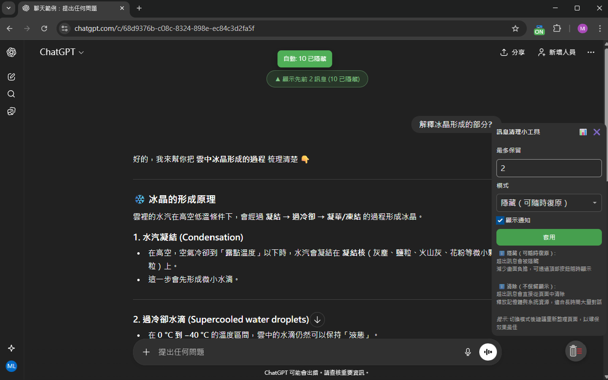

# ChatGPT 訊息清理小工具

**🌐 語言選擇:** [English](../README.md) | [繁體中文](./README_zh-TW.md)

> [!WARNING]
> **本專案已停止維護，且不再建議繼續使用。**
>
> ChatGPT 現已內建對話虛擬化：為完整對話保留輕量的佔位結構，只實際渲染畫面附近
> 的少量訊息，並在使用者捲動時重新載入較舊的內容。實機測試確認，這套官方機制已
> 大幅涵蓋本擴充功能原本想改善的核心效能問題。
>
> 由於本擴充功能會直接隱藏或移除訊息元素，如今可能在捲動時與 ChatGPT 自己的渲染
> 機制互相干擾，造成反覆處理、主執行緒負載增加、捲動不穩，甚至內容載入失敗。
> 商店版本將撤下，本倉庫僅保留為封存的技術紀錄。

<!-- markdownlint-disable MD033 -->

<p align="center">
  
</p>
<!-- markdownlint-enable MD033 -->

曾用於清理 ChatGPT 對話的擴充功能；現僅保留為封存的技術紀錄。


---

## 專案狀態

不再建議新的安裝。Chrome 線上應用程式商店與 Microsoft Edge 附加元件版本將隨
專案收尾撤下。

以下內容僅保留為未發布 v2 分支的歷史文件。

## 歷史功能

* 模式選擇：

  * 隱藏（Hide）：將較舊訊息從畫面移除但保留於 DOM，可隨時還原
  * 刪除（Delete）：從 DOM 完整移除（`Element.remove()`），對超長對話特別有幫助
* 負載保護：偵測任務密度與平均處理時間，系統繁忙時自動暫停
* 空閒/批次：使用空閒時間處理，批次數量會動態調整
* 自動調速：依平均耗時自適應延遲
* 顯示更多（Show previous）：需要時快速還原較舊內容
* 多語言：en / zh-TW / zh-CN

## 功能預覽

<!-- markdownlint-disable MD033 -->
<p align="center">
  
</p>
<!-- markdownlint-enable MD033 -->

---

## 適用範圍與設計考量

此工具著重於「前端視圖層的節流與整理」，藉由降低可見元素與 DOM 壓力來改善體感流暢度；同時尊重站點本身的運作機制。以下情境不直接涵蓋，改善幅度可能依站點設計而異：

* 模型/網路的先天耗時
* 站內全域狀態、虛擬清單、追蹤腳本等非 DOM 成本
* 服務端對話長度、同步/快取或非 DOM 記憶體占用

設計重點：

* 隱藏（Hide）：節點仍在 DOM，但移除視覺與互動（`aria-hidden`、`inert`），可快速還原。
* 刪除（Delete）：節點自 DOM 移除（`Element.remove()`），能釋放 DOM 記憶體；實際效果仍視站點整體行為而定。
* 負載保護：偵測繁忙時暫停，恢復後會再補齊未處理的內容。

簡言之：本工具是「前端視圖層的整理員」，會盡量不與站內複雜機制對撞，也不碰你的帳號/雲端資料。若對話本身極大或站點當下負載很高，仍可能感到卡頓。

---

## 歷史開發環境設定（請勿作為一般安裝方式）

1. 取得程式碼並安裝依賴（pnpm + Corepack）

    ```bash
    git clone https://github.com/MeowXiaoXiang/ChatGPT-Message-Cleaner.git
    cd ChatGPT-Message-Cleaner

    # 啟用 Corepack，並安裝本專案固定的 pnpm 版本
    corepack enable
    corepack install
    pnpm install
    ```

2. 建置（產出 dist/）

    ```bash
    pnpm build
    ```

3. 於 Chrome 載入（擴充功能 → 開發人員模式 → 載入未封裝項目）

    * 開啟 chrome://extensions
    * 開啟「開發人員模式」
    * 點擊「載入未封裝項目」，選擇 `dist/` 資料夾

> 本專案已固定使用 pnpm 10，並提交 `pnpm-lock.yaml`；請透過 Corepack 啟用對應版本，避免 pnpm 版本不一致。
>
> 開發模式可使用 `pnpm dev` 進入 watch 模式（會自動重建並複製靜態資源到 dist）。

---

## 歷史使用方式

* 工具列按鈕：點擊切換啟用/停用（徽章顯示 ON/OFF）。
* 懸浮球（右下）：點擊開啟面板設定 Keep up to / Mode（Hide 或 Delete）/ Notifications。
* 隱藏模式：對話頂部會出現「Show previous」以還原較舊訊息。

---

## 專案結構

```text
│  .gitignore              # Git 忽略規則
│  esbuild.config.mjs      # Esbuild 打包設定
│  LICENSE                 # 授權 (MIT)
│  package.json            # 套件與腳本定義
│  README.md               # 專案說明文件
│  tsconfig.json           # TypeScript 編譯設定
│
├─scripts                  # 輔助腳本
│      zip.js              # 打包 dist/ 成 zip
│
├─src
│  │  manifest.json        # Chrome 擴充功能設定 (Manifest v3)
│  │
│  ├─background            # 背景服務
│  │      background.ts
│  │
│  ├─content               # 前端注入腳本
│  │      constants.ts     # 集中化可調參數
│  │      activity-guard.ts # 使用者輸入中延後自動清理
│  │      debug.ts         # Debug 模式 console API
│  │      dom-utils.ts     # DOM 工具函式（選擇器、樣式、標記）
│  │      follow-up-trims.ts # 初始載入與路由切換後的延遲檢查
│  │      idle-utils.ts    # 空閒時間回調封裝，確保處理順暢
│  │      load-readiness.ts # 未發布的對話載入守門實驗
│  │      long-task-gate.ts # Long Task 壓力狀態與切換
│  │      main.ts          # 主程式進入點與流程控制
│  │      observer.ts      # DOM 變更監聽器與路由偵測
│  │      runtime-diagnostics.ts # 唯讀 selector／虛擬化診斷
│  │      settings-store.ts # 擴充功能專用 storage 設定讀寫
│  │      trim-engine.ts   # 核心訊息隱藏/刪除演算法
│  │      trim-scheduler.ts # idle 排程與自適應 debounce
│  │      turn-inventory.ts # turn 可見/隱藏/刪除狀態追蹤
│  │      types.ts         # 共享的 TypeScript 型別定義
│  │      ui.ts            # UI 元件（懸浮球、面板、提示框）
│  │
│  ├─icons                 # 擴充功能圖示
│  │      chat-icon-*.png / svg
│  │
│  ├─styles                # 注入樣式
│  │      content.css
│  │
│  └─_locales              # 多語言 (i18n)
│      ├─en
│      ├─zh_CN
│      └─zh_TW
│
└─tools
        convert-icons.py   # 產生不同尺寸圖示的工具
```

---

## 權限與隱私

* Manifest v3
* permissions: `scripting`, `storage`, `tabs`
* host_permissions: `https://chat.openai.com/*`, `https://chatgpt.com/*`
* 設定儲存在擴充功能專用的本機儲存空間
* 僅在前端操作 DOM，不蒐集或上傳對話內容與個資。

---

## 歷史開發

```bash
# 型別檢查
pnpm typecheck

# 開發模式（watch）
pnpm dev

# 產生發佈檔（dist/）
pnpm build

# 壓縮打包 dist 為 zip
pnpm zip
```

### Debug

Debug 模式儲存在擴充功能專用的本機儲存空間。於 ChatGPT 頁面的 DevTools 選擇本擴充功能的 content script context，然後執行：

```js
await __ccxChatCleanerSetDebug(true)
```

頁面會自動重新載入。重載後可使用：

```js
__ccxDebug.explainSelectors()
__ccxDebug.explainActivity()
__ccxDebug.report()
```

`explainSelectors()` 會回報目前設定的 selector 命中數，也會列出較寬的頁面探針，例如
`#thread`、`[data-turn-id]`、message-role 節點與 composer 候選數。
`explainActivity()` 可確認目前聚焦的 composer 與近期輸入活動是否有被偵測到。

關閉 Debug：

```js
await __ccxChatCleanerSetDebug(false)
```

## 隱私權政策

本擴充功能尊重您的隱私權，不會收集任何個人資料。詳細資訊請參閱[隱私權政策](./PRIVACY.md)。

## 授權條款

[MIT License](../LICENSE)
